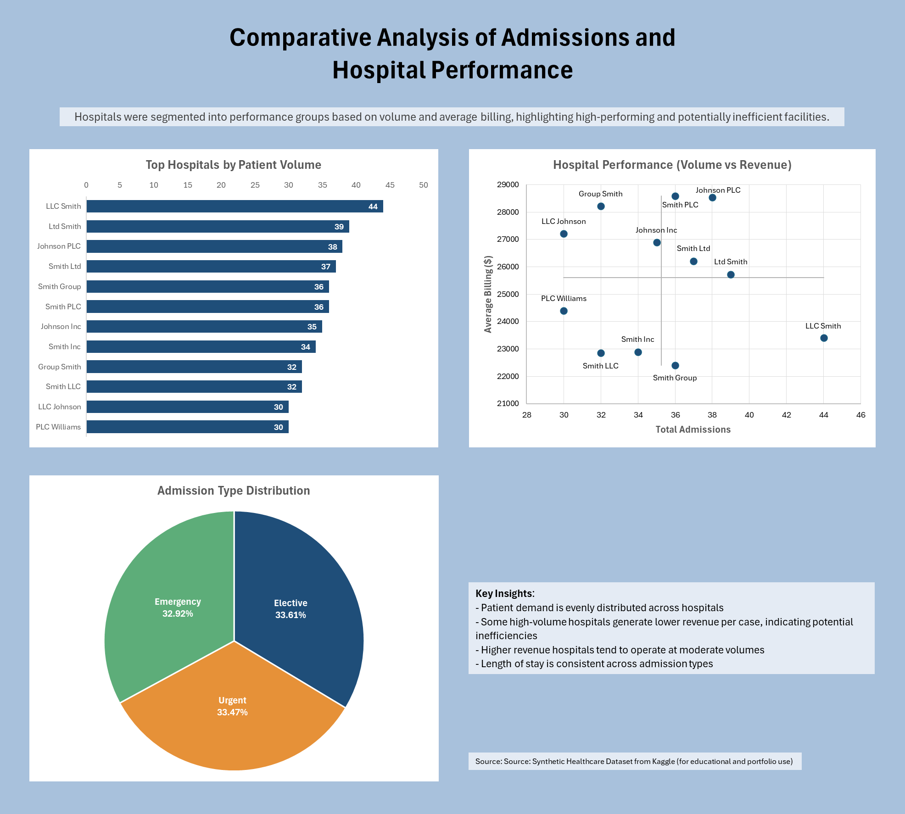

# Comparative Analysis of Admissions and Hospital Performance

---

## Project Overview
This project analyses healthcare data to compare admission types and performance across multiple hospitals. The objective was to identify differences in patient volume, revenue per case, and operational efficiency, and to highlight high-performing and underperforming facilities.

The project was built using PostgreSQL for data preparation and analysis, and Excel for dashboard development and visualisation.

---

## Tools & Technologies
- PostgreSQL
- pgAdmin 4
- Microsoft Excel

---

## Data Source

Dataset: Healthcare Dataset  
Author: Prasad Patil  
Source: Kaggle  
Link: https://www.kaggle.com/datasets/prasad22/healthcare-dataset

This project uses a synthetic healthcare dataset created for educational, data analysis, and machine learning purposes. The dataset is used here solely for non-commercial portfolio and learning purposes.

---

## Project Workflow

### 1. Data Preparation
- Imported raw healthcare data into PostgreSQL
- Cleaned and structured the dataset
- Created relational tables for:
  - patients
  - hospitals
  - admissions
  - doctors
- Added primary keys and relationships between tables

### 2. SQL Analysis
Performed analysis using:
- JOINs
- Aggregations (`COUNT`, `AVG`)
- CASE statements
- Window functions
- Summary tables

Key metrics analysed:
- Total admissions
- Average billing amount
- Volume versus revenue
- Admission type distribution

### 3. Dashboard Development
Built an Excel dashboard to visualise:
- Top hospitals by patient volume
- Admission type distribution
- Hospital performance (volume vs revenue)

 

A scatter plot with reference lines was used to segment hospitals into performance groups based on average admissions and average billing.

 

Hospital performance was analysed by comparing patient volume and revenue per case, and segmented hospitals into four categories using average-based quadrants:

1️⃣ Top-right: High volume + high billing 
✔ Best performers

2️⃣ Bottom-right: High volume + low billing 
⚠️ Inefficient / low revenue per patient

3️⃣ Top-left: Low volume + high billing 
* Specialised / premium services

4️⃣ Bottom-left: Low volume + low billing 
↓ Low activity / lower performance

 

Time-based analysis at hospital level was considered but excluded due to low observation frequency, which would not produce statistically meaningful trends.

---

## Key Insights
- Patient demand is relatively evenly distributed across hospitals
- Some high-volume hospitals generate lower revenue per case, indicating potential inefficiencies
- Other hospitals achieve higher revenue at moderate patient volumes, suggesting specialised services
- Length of stay is relatively consistent across admission types

---

## Limitations
Time-based analysis at hospital level was considered but excluded due to low observation frequency per hospital, which would not produce meaningful trends.

---

## Dashboard

---

## Skills Demonstrated
- SQL data analysis
- Relational database design
- Data cleaning and transformation
- Analytical thinking
- Dashboard development in Excel
- Business insight communication
